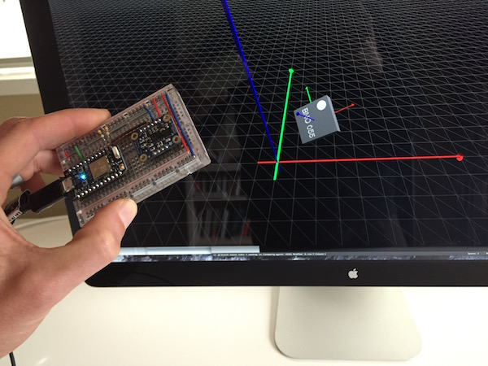

## Overview
This is a small project that enables real-time visualization of an object's orientation in space, using an absolute orientation sensor like the Bosch Sensortec BNO055. It does pretty much the same thing as the Adafruit [bunny example](https://learn.adafruit.com/adafruit-bno055-absolute-orientation-sensor/processing-test), but using a different software stack.

Instead of Processing, this project uses a server written in Julia and [three.js](http://threejs.org/). The sensor data is read from a microcontroller over a UART serial line to the server using [LibSerialPort.jl](https://github.com/andrewadare/LibSerialPort.jl.git). From there, the server sends JSON-formatted messages using the WebSockets protocol. Yowza! Now it's in your browsa! It looks something like this:

## Microcontroller firmware
I used a Photon from [Particle](https://store.particle.io/) for this project. For now, the Particle is just sending data over the UART serial line, but in the future TCP/IP over WiFi will probably be added. The NAxesMotion library from the [brackets-arduino](https://github.com/arduino-org/brackets-arduino.git) repo, which wraps the [BNO055 driver](https://github.com/BoschSensortec/BNO055_driver.git), was used to control the sensor. These libraries are intended for the Arduino environment, and did not quite work out of the box with my preferred toolchain for the Photon (namely ARM gcc and `dfu-util`), so I included modified versions in the `firmware/` directory.

## Running
Start the server by doing `julia imu-server.jl` and browse to `localhost:8000`.